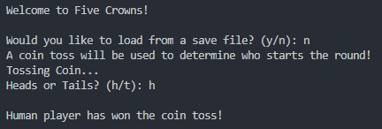
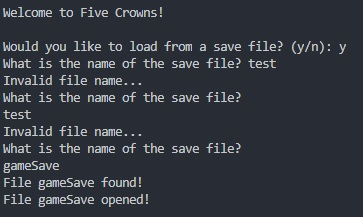
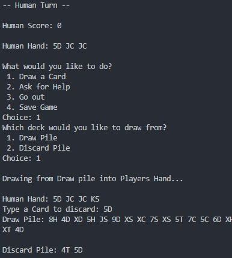
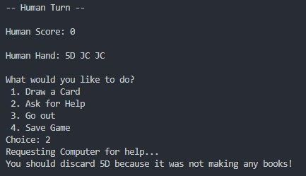
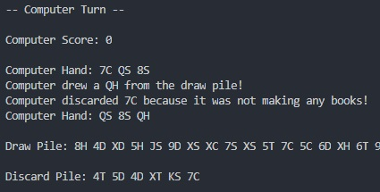
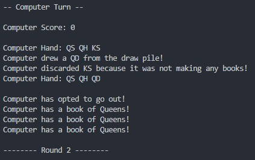
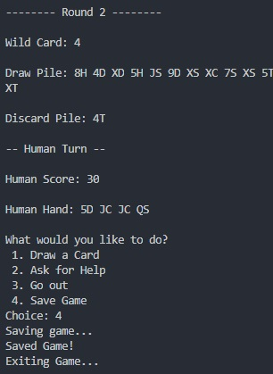

# Manual

## Bug Report

Bug Report contains a list of all known bugs in the program.

- Discarding a duplicate card in Player's hand will result in both cards getting discarded.
  - **Example:** If the players hand is 3T 3T 4C 5S, discarding 3T will remove both cards.
- Player order is locked to the starting order.
  - The player that wins the coin toss will go first every round
- Computer will go out on automatically the moment it finds a book of at least 3 cards.
  - For the sake of the demo, automatically going out was turned off.
- Computer go out loop prints the book it has multiple times

## Feature Report

Feature Report contains information on missing features and extra features.

### Missing Features

- Creating Runs
  - There is no logic in place for creating runs for players
- Next Player
  - Next Player does not show, or load in from the game save. The input is ignored.
- Jokers and Wild Cards do not behave differently in Books / Runs
  - Jokers do not give 50 points
- Help Mode is missing the recommendation for drawing from draw / discard pile
- Help Mode is missing the recommendation for when to go out
- Automatically going out was disabled since it runs the moment the computer gets a book of 3 cards

### Extra Features

- The game _can_ support more than 2 players, however this functionality was written out

## Description of Data Structures / Classes

This section includes a description of the classes and data structures used. It also includes a description of inheritance and composition of classes.

### Data Structures

- **Vector**
  - Vectors were used frequently in this project. They were used for player hands, decks, the player list, and for serialization.
- **Arrays**
  - Arrays were used for tracking books
- **Sort**
  - Sort was used to sort the players hand in ascending order
- **Shuffle**
  - Shuffle was used to shuffle the decks

### Classes

- **Card**: The actual Cards used in the game
- **Deck**: The decks used in the game
  - Deck creates a vector of Cards
- **Player**: The parent player class, stores logic shared by subclasses
  - Player creates virtual functions for Computer and Human to modify and use
- **Computer**: Subclass of parent, holds logic not shared by Human
  - Extends the functionality of Player polymorphically
- **Human**: Subclass of parent, holds logic not shared by Computer
  - Extends the functionality of Player polymorphically
- **Round**: The round functionality of the game
- **Game**: The game functionality, it handles calling round for the game loop
- **Main**: Main file for the project, creates and runs the Game object

## Log

This is the raw commit log, containing commit messages and time stamps for everything I've worked on in the project. The list is ordered from the latest commits first.
If someone were to take over the project, the modified files would show on each commit on the repository.

I worked on this project roughly 1 - 4 hours a night, almost everyday. There were some days where I had outside obligations and could not work on the project.

I spent the first week creating an outline of a game. I created the card and deck functionality, then created a very basic human player. The AI functionality was the last part I worked on, since I wanted to establish a framework for a functioning game.
By the second week, the game could cycle between players each round. The human functionality was fully fleshed out by the end of the second week.
I spent the last week working on serialization, the computer AI, and some misc. features.

```
commit 9b62a1078c7adacc6f8abf7b5f0f821699ece27d
Author: Stefan S <stefanlawr@gmail.com>
Date:   Mon Sep 30 23:02:46 2019 -0400

    AI Changes and Serialization Load In User Input

commit fab7a64bc8c39344a1852c89404d93abfda00403
Author: Stefan S <stefanlawr@gmail.com>
Date:   Sun Sep 29 21:27:04 2019 -0400

    Added Game Over function

commit aa798141d27b590d967c6e40c0fcfff76674f040
Author: Stefan S <stefanlawr@gmail.com>
Date:   Sat Sep 28 22:27:24 2019 -0400

    Properly checks discard pile first

commit 98fe9c826cd17b0a023ea2b7cfd81f3b927747b3
Author: Stefan S <stefanlawr@gmail.com>
Date:   Sat Sep 28 22:08:24 2019 -0400

    AI Goes out on Books

commit 7600097d85f1d335ece3977bf70dfae65422568c
Author: Stefan S <stefanlawr@gmail.com>
Date:   Sat Sep 28 13:24:43 2019 -0400

    Load File works

commit bdbac5df6c05112eeb8336a73f3fe8aaf0f6594d
Author: Stefan S <stefanlawr@gmail.com>
Date:   Fri Sep 27 21:29:34 2019 -0400

    Loading game WIP

commit 15301a3c279c37a3059577e8687b49489aee8b28
Author: Stefan S <stefanlawr@gmail.com>
Date:   Fri Sep 27 19:31:23 2019 -0400

    Refactored some logic; serialization

commit e5393c0562a1b3f79de8e062657ac046460c1393
Author: Stefan S <stefanlawr@gmail.com>
Date:   Thu Sep 26 21:23:49 2019 -0400

    Saved game WIP

commit e672a77048246568a7660726edd2aaa425c9e928
Author: Stefan S <stefanlawr@gmail.com>
Date:   Thu Sep 26 20:55:19 2019 -0400

    Refactor; Saving Game

commit e82caf302423521a469688d43d04b996b41cdf1f
Author: Stefan S <stefanlawr@gmail.com>
Date:   Wed Sep 25 21:04:32 2019 -0400

    Player score

commit b6af3dd81114ff44dbeafbb9983b4f326a51584f
Author: Stefan S <stefanlawr@gmail.com>
Date:   Tue Sep 24 19:59:57 2019 -0400

    Fixed Seg Fault with Go Out

commit 5c1973d079c93840d73185eeee658b9d2e80ba65
Author: Stefan S <stefanlawr@gmail.com>
Date:   Tue Sep 24 18:31:28 2019 -0400

    Human Book Logic working

commit c998200d7667f1d10fb9c8e7e9156ef226850a66
Author: Stefan S <stefanlawr@gmail.com>
Date:   Sun Sep 22 17:14:39 2019 -0400

    Go Out WIP

commit 3b4ece3a983a8e2c87c4d20c880494805f4a14ff
Author: Stefan S <stefanlawr@gmail.com>
Date:   Sat Sep 21 15:17:28 2019 -0400

    Round correctly resets; Draws correct num of cards

commit e8ff77c1126c938d4c8afff6e718a97dbb6b6931
Author: Stefan S <stefanlawr@gmail.com>
Date:   Fri Sep 20 19:05:48 2019 -0400

    Players Turn Fixed

commit 5e27c37a47f2d871450b188ba59cc7893131f771
Author: Stefan S <stefanlawr@gmail.com>
Date:   Fri Sep 20 18:09:19 2019 -0400

    Round System WIP

commit a6e10dde6912097aad4bcd62c9be91faf92534ca
Author: Stefan S <stefanlawr@gmail.com>
Date:   Thu Sep 19 21:52:19 2019 -0400

    WIP Discard  --NOT WORKING--

commit 739e2f4cb10e2f2eb040e2a25209d5e7be83a11d
Author: Stefan S <stefanlawr@gmail.com>
Date:   Wed Sep 18 22:03:43 2019 -0400

    Drawing cards from deck to hand in Game WIP

commit 0268249f719d150af24288ddfbb9d91250ed353b
Author: Stefan S <stefanlawr@gmail.com>
Date:   Wed Sep 18 20:06:31 2019 -0400

    WIP Discard and Misc. Changes

commit 6c2bd913d510391de2b9cdcff3f425345d154a76
Author: Stefan S <stefanlawr@gmail.com>
Date:   Tue Sep 17 20:54:44 2019 -0400

    Replaced Array w/ Vector; Player Virtual functions

commit 7722bae95d5e2305ed6955280a9c8e1bd1fa0e84
Author: Stefan S <stefanlawr@gmail.com>
Date:   Tue Sep 17 18:10:45 2019 -0400

    Players draw cards

commit 32c68faf117a826b667031c54f0886c1dbe02dda
Author: Stefan S <stefanlawr@gmail.com>
Date:   Mon Sep 16 20:34:20 2019 -0400

    Player initialization logic WIP

commit ca4e999c6bc1ef6468f23172e5c96ea0d56f3ca4
Author: Stefan S <stefanlawr@gmail.com>
Date:   Fri Sep 13 15:39:59 2019 -0400

    Added Jokers to Deck; Created Game and Round

commit 26b3587151147bd3ced257b5891743091d96aa28
Author: Stefan S <stefanlawr@gmail.com>
Date:   Fri Sep 13 15:10:00 2019 -0400

    Polymorphic Behavior

commit 2d95c1c0de335387b5ade906758f851d7947550a
Author: Stefan S <stefanlawr@gmail.com>
Date:   Fri Sep 13 14:58:26 2019 -0400

    Computer and Human polymorphic behavior WIP

commit a40a8234ad1fc26f8bf24b59eaca082cf2a0dbbc
Author: Stefan S <stefanlawr@gmail.com>
Date:   Wed Sep 11 21:06:43 2019 -0400

    Player functionality WIP

commit 16f11618e693fa6e8b6e6439ab4282e118c1d51c
Author: Stefan S <stefanlawr@gmail.com>
Date:   Wed Sep 11 20:35:36 2019 -0400

    Computer, Player, Human Class Templates

commit 208403fded7e0a5b44be5bef7969463fc7492c19
Author: Stefan S <stefanlawr@gmail.com>
Date:   Tue Sep 10 20:52:24 2019 -0400

    Updated comment

commit ca7856aaba5107fd818f4ea15fbe95228b40e2f1
Author: Stefan S <stefanlawr@gmail.com>
Date:   Tue Sep 10 20:51:58 2019 -0400

    Shuffle deck and draw a card

commit a02339b35bb97cf4ec34ad4a9fd53a1ed15aa3ca
Author: Stefan S <stefanlawr@gmail.com>
Date:   Tue Sep 10 20:09:25 2019 -0400

    Creates and prints deck

commit cf9ced75ed1c75463fe8cc48b2ffd3d3aeb8bc0d
Author: Stefan S <stefanlawr@gmail.com>
Date:   Mon Sep 9 20:01:48 2019 -0400

    Started Card

commit 5ace86e70700bbb4a67100d9242dc62722bc7aa8
Author: Stefan S <stefanlawr@gmail.com>
Date:   Sun Sep 8 15:30:02 2019 -0400

    First commit

```

## How to Run

In order to run this program, you need a computer that has access to a C++ compiler.

I developed this program on a Window machine using Visual Studio Code and the MinGW C++ Compiler.

```sh
# Command to build the program
g++ Card.cpp Deck.cpp Player.cpp Computer.cpp Human.cpp Round.cpp Game.cpp main.cpp

# Windows - Running the Program
./a.exe

# Mac / Linux - Running the Program
./a.out
```

## Screenshots

### **Coin Toss**



### **Reading in a save file**



### **Human drawing a card**



### **Human asking for help**



### **Computer drawing a card**



### **Computer going out automatically**



### **Saving the game**



## References

This section is where I give credit to code or tools I referenced.

- Deck Shuffle
  - I’m not sure how I’m going to shuffle the deck so that it’s completely random every time shuffle is called
  - For now, I’m using [default_random_engine](http://www.cplusplus.com/reference/random/default_random_engine/) from the random library which I read up on.
  - I also implemented the [shuffle](http://www.cplusplus.com/reference/algorithm/shuffle/) function from the algorithm library to shuffle the vector of cards.
- Card Sorting
  - I read up on the syntax of the [sort](https://en.cppreference.com/w/cpp/algorithm/sort) function and learned about the third optional parameter of type [Compare](https://en.cppreference.com/w/cpp/named_req/Compare) and the usage of [lambda functions](https://en.cppreference.com/w/cpp/language/lambda) to implement sorting of objects
